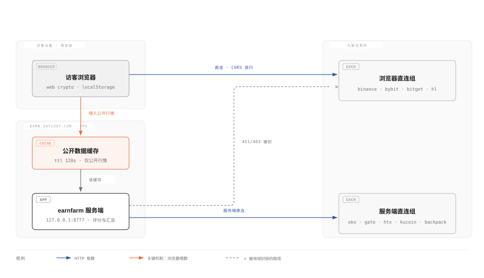
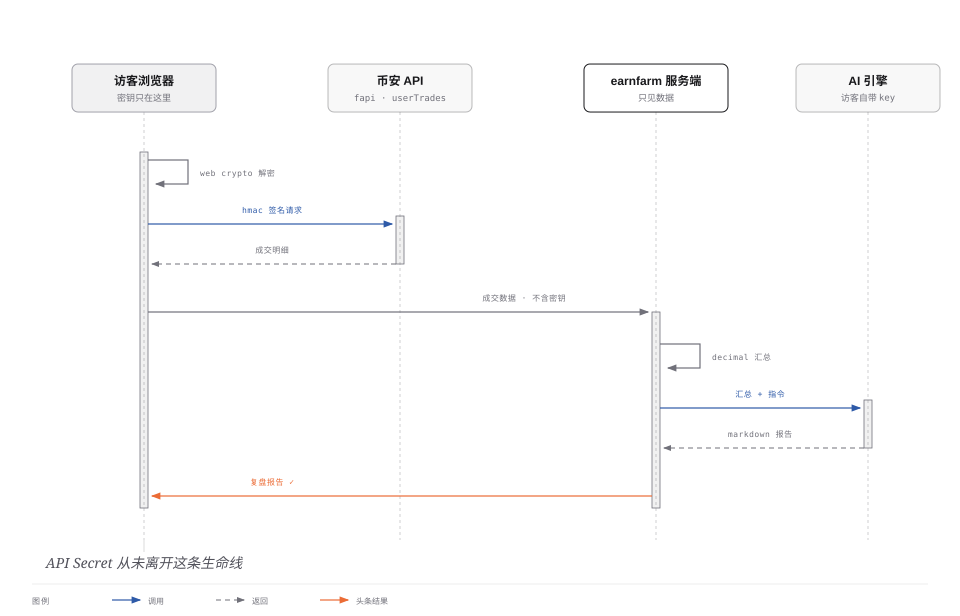

# earnfarm

跨交易所资金费率套利工具。在币安、OKX、HTX、Gate、Bybit、Bitget、Hyperliquid、
KuCoin 八家之间找同一个币的资金费差，一边做多一边做空，赚两边费率的差额，
不吃价格波动。Hyperliquid 是每**1 小时**结算一次的链上永续——结算频率和
CEX（4/8 小时）不同步，它和 CEX 之间天然比 CEX 互相之间更容易出费差。

这份文档不是功能清单。它是**用这个工具之前你该知道的事**——尤其是它算出来的结论，
大概率和你想看到的不一样。

---

## 先说结论：绝大多数机会是负期望

2026-08-01 的一次实测。六家全部连通，名义仓位 5 万美元，假设持有 72 小时，
榜上 60 个候选，**120 条腿全部有真实历史数据**（不是先验、不是估算）：

| 判决 | 数量 |
|---|---|
| 可做（good / sized_down） | **0** |
| 负期望（negative） | 52 |
| 做不了（unexecutable，深度不够） | 8 |

榜首那几个长这样：

| 币 | 毛年化 | 净年化 | 往返成本 |
|---|---|---|---|
| BTC | +6.9% | **−8.2%** | 0.20% |
| ONDO | +46.7% | **−17.4%** | 0.34% |
| AERO | +34.2% | **−17.9%** | 0.37% |
| BNB | +24.9% | **−14.4%** | 0.31% |

ONDO 的毛年化 46.7% 是真的，它不是 bug。净年化 −17.4% 也是真的。
两个数字之间隔着这个工具存在的全部理由：

**1. 成本要按持有期摊销，而不是按年。**
0.34% 的往返成本听着像噪音。但你持有 72 小时就平掉，这 0.34% 就要摊在
3 天上——年化 41%。开平各两笔、共四笔 taker 手续费加滑点，是这门生意里
最大的一笔支出，通常比你赚的资金费还多。

**2. 当前费率不可外推。**
"现在费率是 0.05%，一年 8760 小时，所以年化 46.7%" —— 这句话是错的，
而几乎所有同类工具的榜单都是这么排的。资金费是均值回复的：一个飙到 46% 的
费率，最常见的下一步是掉回去，不是保持。本工具的净年化用的是**历史回测出来的
预期收益**（把这个币的资金费历史按你的持有期滚动，看它实际能收到多少），
而不是把此刻的快照乘以 8760。毛年化那一列只是拿来对照的，**不要看它做决定**。

所以：**看到满屏"负期望"是这个工具在正常工作，不是它坏了。**
资金费套利常常整段时间都没有正期望的机会，那时候不做才是对的。
真能做的机会稀少而且短暂，常常只活几个小时——这也是为什么有守护模式。

---

## 第二件事：成本是结论变量，不是精度问题

费率档位不是"算得准一点"的问题，是**判决正反的问题**。同一个机会、同一份行情、
同一份历史，只换费率档位（`tests/test_fees.py` 里有一个金标准测试钉着这组数）：

```
持有期收益 = 9 次结算 × 2.4bp        = 0.00216
VIP0 成本                            = 0.00263  → 净年化 −2.9%  判 negative
VIP3 成本                            = 0.00113  → 净年化 +6.3%  判 good
```

毛年化两边一字不差，变的只有成本，结论从"别做"翻成"能做"。

因此：

- **没连账户时，榜上所有成本都是按各家 VIP0 挂牌价估的**，界面会在成本列打黄色
  `*`、在摘要行直接写"成本按 VIP0 挂牌价估算"。看到星号就意味着这一行的判决
  可能因为你的真实档位而反过来。
- **连上账户后自动换成你的真实档位重算**。七家 CEX 走签名端点拿真实费率；
  Hyperliquid 用你的主钱包地址查公开的 userFees（质押折扣已折算在内，不再重复打折）。
  账户页会显示"费率档位：已按你的真实档位计算"。
- **查不到某个品种的档位时，工具返回"没查到"而不是零。** 这条听起来是废话，
  但零手续费会让四笔往返成本整个消失、负期望的机会全片翻成正期望，而且不报错。
  这是这类代码里最贵的一种静默 bug。

### 平台币抵扣（BNB / GT / OKB / BGB）

一句话：**状态会告诉你，但成本不打折。**

- **Gate GT**：不用管。`/futures/{settle}/fee` 返回的已经是 VIP 档 + GT 折扣叠加后的
  最终费率，再乘一次就是重复打折。
- **币安 BNB**：开关状态读得到（`/fapi/v1/feeBurn`），**折扣幅度读不到**——它不在
  任何 API 里，只挂在帮助中心文案上，随时可改。所以工具只把"BNB 抵扣已开启"写进
  附注给你看，不擅自削成本。
- **OKX OKB**：早已并进 `level` 字段，返回值即最终档位。
- **Bybit / Bitget BGB / HTX 点卡**：衍生品没有可读的抵扣开关，接口返回的就是最终扣费率。

方向是安全的：实际扣费只会比工具显示的更低，不会更高。宁可低估收益，不可低估成本。

---

## 怎么跑

需要 Python 3.11+（用了 `tomllib`）。依赖只有三个：`httpx`、`nicegui`、`cryptography`。

### 界面模式

```bash
python run.py                # 浏览器打开 http://127.0.0.1:8777
python run.py --port 9000
python run.py --offline      # 用离线演示数据，不联网
```

必须走 `run.py` 这个顶层脚本，不能 `python -m earnfarm.ui.app`：NiceGUI 的
`ui.run()` 会用 `runpy.run_path` 重跑入口文件，那条路径不带包上下文，包内的
相对导入会全部炸掉。

默认**只监听回环地址**。要对外提供访问，必须在配置里显式打开 `allow_public`
并配好 TLS 证书——会话 cookie 和配对码在明文 HTTP 上会被中间人截获。

### 守护模式（无界面，7×24）

```bash
python run.py --watch                  # 跑起来，有机会才推送
python run.py --watch --once           # 只跑一轮就退出（cron / 排错）
python run.py --watch --status         # 问一句"它还活着吗"
python run.py --watch --log-file /var/log/earnfarm.log   # 自动轮转 5MB×3
python run.py --watch --config /etc/earnfarm.toml
python run.py --watch -v               # 连 httpx 的每个请求都打出来
```

这条路径**一行 nicegui 都不导入**，服务器上不用装它。

启动时会打一段自检，把最容易配错的事直接说出来：

```
行情源：6 家公开端点（binance、okx、htx、gate、bybit、bitget），实际连通以首轮行情为准
账户：6 个；推进已有仓位：否（凭据库没解锁，要解锁请设环境变量 EARNFARM_MASTER_PASSWORD）
告警通道：log　（只有本地日志通道：手机上收不到任何东西，去 [alerts] 配一个通道）
节奏：行情 300s／历史 1800s／仓位 500ms
数据库：C:\Users\YJQ\.earnfarm\earnfarm.db
```

`--status` 的存在是为了分清"没机会"和"进程死了"——这两件事在推送上长得一模一样：

```
● 已停止（优雅退出，26 秒前）——不是崩溃，是有人让它停的。
  行情：1 轮（最近一轮 9 秒前），已连 binance、okx、htx、gate、bybit、bitget
  榜单：40 行，可执行 0 行；累计告警 0 条
  仓位：0 个（纸上，未接管）
  告警通道：log
```

主密码只从环境变量读，绝不落配置文件：`EARNFARM_MASTER_PASSWORD`
（`EARNFARM_PASSWORD` 也认，向后兼容）。不给密码就跑"只看不做"模式——
行情和告警照常，仓位一律不碰。

---

## 配置

配置文件 `~/.earnfarm/config.toml`，**不存在也能直接跑**（全默认值，只是没有账户）。
数据库固定在 `~/.earnfarm/earnfarm.db`。所有可调项都集中在 `earnfarm/config.py`，
没有第二处配置来源。写了不认识的段或键会直接报错，不会被静默忽略。

```toml
[scoring]
assumed_holding_days = 7      # 开平成本按几天摊销
history_days = 30             # 回看多少天历史做稳定性评分
min_net_apr = 0.05            # 净年化低于此值直接标负期望
stability_weight = 0.35       # 排序时历史一致性的权重
fallback_taker_fee = 0.0005   # 查不到真实档位时的兜底（就是那个会骗人的挂牌价）

[server]
host = "127.0.0.1"            # 非回环地址必须同时开 allow_public 且配 TLS
port = 8777

[safety]
naked_retry_seconds = 30      # 单腿裸奔多久后强制撤退
circuit_breaker_failures = 20 # 连续下单失败多少次整体停机等人工
leverage_mode = "conservative"

[watch]
market_interval_s = 300       # 硬下限 180 秒，见下
history_interval_s = 1800
notional = 50000
horizon_h = 72
alert_max_per_round = 5       # 一轮推 20 条等于一条都没推

[alerts]
enabled = true
min_net_apr = 0.30            # 注意：远高于 scoring.min_net_apr
min_capacity_usd = 5000
silence_opportunity_s = 14400 # 同一个机会 4 小时内不重复推
silence_risk_s = 900

[alerts.wechat]               # PushPlus
enabled = true
token_env = "EARNFARM_PUSHPLUS_TOKEN"

[alerts.telegram]
enabled = true
bot_token_env = "EARNFARM_TELEGRAM_BOT_TOKEN"
chat_id_env = "EARNFARM_TELEGRAM_CHAT_ID"

[alerts.webhook]              # style: raw / feishu / dingtalk / bark
enabled = true
style = "feishu"
url_env = "EARNFARM_ALERT_WEBHOOK_URL"

[analysis]                    # 操作复盘页（/analysis）
default_engines = ["claude"]  # 页面默认勾选的引擎，可多选：claude / grok / codex / api
claude_cmd = "claude"         # Claude Code CLI 的命令名或完整路径
grok_cmd = "grok"             # Grok CLI，同上
codex_cmd = "codex"           # ChatGPT Codex CLI，同上
api_url = "https://api.anthropic.com/v1/messages"   # 线上 API 的接口地址
api_style = "anthropic"       # 报文风格：anthropic / openai（xAI、DeepSeek、中转站都走 openai）
api_model = "claude-sonnet-5" # 线上 API 用的模型名
api_key_env = "EARNFARM_AI_API_KEY"   # key 走这个环境变量，绝不写进本文件
api_max_tokens = 8192         # 线上 API 单次回复的 token 上限
timeout_s = 600               # 单个引擎的超时；数据多时模型要算一阵，太短会掐死正常分析
max_fills = 2000              # 嵌入 prompt 的成交上限，超出截最新（汇总统计仍按全量算）
default_days = 7              # 页面默认回看天数
```

几个容易踩的点：

- **`alerts.min_net_apr` 默认 30%，`scoring.min_net_apr` 默认 5%。** 两个不是一回事：
  前者是"值不值得把人从别的事上拉过来"，后者是"值不值得列在榜上"。前者标准必须更高。
- **`watch.market_interval_s` 有 180 秒硬下限。** 一轮完整刷新实测约 105 秒，
  配得更短的后果是程序永远在刷新，并且把六家的限频配额全花在自己身上。
- **所有密钥走 `*_env` 指向的环境变量，不要填字面量。** config.toml 是明文文件，
  它会被备份、被同步到网盘、被贴进聊天框。飞书/钉钉的 webhook URL 本身就是密钥。
- **告警门槛只在 `[alerts]` 里配，`[watch]` 不重复一份。** 同一个阈值放两处，
  早晚会出现"调高了却还在响"的鬼故事。

一个通道都没配也能正常跑：降级成只写本地事件表，不报错、不崩，但**手机上收不到
任何东西**——自检那行会明说这件事。静默地不发告警比配错更危险。

---

## 双市场溢价监控（/premium）

同一家公司在两个市场上市、而两地间的股份转换通道受阻时（外汇管制、存托份额
上限），两条腿之间会出现**持续不归零的溢价**。币安把 SK 海力士的两条腿都做成
了 USDⓈ-M 永续（`SKHYUSDT` = 纳斯达克 ADR，`SKHYNIXUSDT` = 韩交所普通股，
10 份 ADR = 1 股），这一页盯的就是这个价差。

**口径必读：页面上所有价格都来自币安永续（fapi 公开端点），不是纳斯达克 /
韩交所的现货报价。** 溢价是两个永续之间的价差口径——每个永续自带一点基差，
和"ADR 现货 vs 韩股现货"的真溢价能差 1~2 个百分点。对在币安下单的人来说
永续口径才是能成交的价格；要算涉及真实股票交割的转换套利，得另拉现货数据。

- **没有自动刷新，一个定时器都没有。** 溢价的锚（两地现货价）一天只各更新
  一个交易时段，其余时间两个永续都拴在冻结的指数价上，定时重拉换来的只是
  噪音。打开时拉一次，之后手动点。每次刷新一共 6 个公开请求，无需任何 key，
  也不占八家全市场刷新的限频配额。
- **回测曲线默认回看三周，可在页面上改**（3 天 ~ 2 个月；上限受 fapi 单请求
  1500 根 K 线约束）。上区两条价格线，下区溢价率贴轴放大、虚线为回看期均值。
- 加新配对改 `earnfarm/premium.py` 的 `DUAL_PAIRS` 一行即可——前提是两条腿
  都是**同一公司的普通股/ADR**。杠杆 ETF（如 CSOP 2x 系列）进不了这个表：
  每日再平衡的损耗会让"溢价"永远算不平，那不是溢价是损耗。

## 操作复盘（/analysis）

拉某个标的一段时间的**真实成交记录**（逐笔 fill，含手续费与已实现盈亏），
本地先用 Decimal 算好汇总统计，再连同持仓/挂单/资金费上下文一起交给
分析引擎生成 Markdown 复盘报告——时间线、成本、盈亏归因、行为模式、
改进建议。报告同时存进 `~/.earnfarm/analysis/`。

- **引擎可多选并行，各出一份报告**：本机 Claude Code CLI / 本机 Grok CLI /
  本机 ChatGPT Codex CLI / 线上 API，勾几个跑几个，互相独立、互为对照。
- **线上 API 支持两种报文风格**：`anthropic`（Messages API）和 `openai`
  （chat/completions）——xAI、DeepSeek 和各家中转站都兼容 openai 风格。
  key 走环境变量（`api_key_env` 指向的那个），**绝不进配置文件**。
- **线上 API 可在页面上选服务商预设**：DeepSeek / xAI / Anthropic / 自定义
  四选一，URL、报文风格和模型名替你填好。key 直接在页面上填，也可以
  **加密保存**——与交易所凭据同一个 vault、同一把主密码；页面没填 key 时
  仍回退环境变量。
- **单币分析模式（免凭据）**：不填任何交易所凭据也能用——只拉币安公开行情
  （K 线、24h 快照、标记/指数价、资金费率历史）做单币走势分析，
  没有成交记录也就没有复盘，只看行情结构。分析任务在**后台**跑，
  切到别的页面再切回来，进度和报告都不会丢。
- **标的支持模糊输入**：比如输入"海力士"会解析成 `SKHYUSDT` + `SKHYNIXUSDT`
  两条腿一起复盘；本地词表认不出的输入，交给选中的第一个引擎对着
  币安全量符号表去认。
- **复盘凭据与套利账户同库同加密，但分类隔离**（accounts 表的 kind 字段）：
  套利连接永远不会碰复盘专用凭据，反之亦然。也可以临时填一组 API——
  临时凭据只活在这次分析的适配器对象里，不进 vault、不落盘。
  复盘 key 只需要**读取**权限，不要开交易和提币。
- **发给引擎子进程的只有成交数据，没有任何密钥材料**；数据走 stdin，
  不经过命令行参数，也不落临时文件。
- 分析是显式动作：点一次跑一次，没有定时器。模型不预测行情，报告只基于
  拉到的数据——数据里没有的它被明确要求不许编。
- 成交历史目前只有币安（USDⓈ-M 永续，`/fapi/v1/userTrades` 按 7 天窗翻页）
  实现了；其他交易所选了会明说"尚未实现"，不会假装分析。

## 它不会做的事

- **不会自己开仓。** 守护模式只看榜、推历史、发告警、推进**本进程内**已有的仓位。
  开仓必须是人在界面上做的决定。
- **目前只有纸上撮合网关**（行情真实、成交模拟）。界面和守护模式都不会自作主张切实盘。
- **守护模式的仓位循环实际上是空转的。** `Trader` 还没有从数据库重建运行时状态的入口
  （`hedges` 表存的是目标和状态，逐分片的成交进度在内存里），而守护模式又从不自己开仓，
  所以它能推进的仓位数恒为 0。要补这一块需要 `Trader.load_open_hedges()`，
  属于执行层改动。自检和文档都照实说，没有假装覆盖了。
- **去重状态在内存里。** 重启后可能把一个仍然存在的机会重推一次。
- **`taskkill /F`（和 SIGKILL）仍会丢内存状态**，这个没有任何程序能兜。
- **没有进程守护。** 日志轮转有了，崩溃重启是操作系统的活（NSSM / 计划任务 / systemd）。

## 公开版架构（earn.satloot.com）

公开部署要同时解过两道题：服务器所在地区被部分交易所按 IP 封锁（币安 451、
Bybit 403），以及**绝不托管访客的交易所密钥**。答案是同一个：把取数搬进访客的浏览器。

**混合取数**——九家交易所按两侧实测可达性分流。被封的家由访客浏览器直连并把
公开行情喂进服务端缓存；对浏览器关闭 CORS 的家仍由服务端直连（它们没封服务器）：



**操作复盘的隐私边界**——访客的 API 密钥用他自己设的密码在浏览器里加密
（Web Crypto），HMAC 签名也在浏览器里算，服务端自始至终只见到成交数据：



## 安全

API key 用主密码派生的密钥加密后存本地 SQLite，明文不落盘。配 key 时**只开
「读取」+「交易」权限，务必关掉提现，并绑定 IP 白名单**——这个工具永远不需要提现权限。

## 测试

```bash
python -m pytest tests/ -q      # 全绿为准，具体条数随功能增长
```

测试全部离线（不发任何网络请求）。其中有一条源码扫描，禁止仓库里出现任何
≥24 位十六进制串和长字面量 token。

## 代码地图

| 文件 | 干什么 |
|---|---|
| `earnfarm/public_feed.py` | 拉八家全市场资金费、配对、算成本 |
| `earnfarm/scoring.py` | 净年化 / 回本 / 稳定性 / 容量 / 判决 |
| `earnfarm/history.py` | 历史资金费回填，落 SQLite |
| `earnfarm/session.py` | 凭据库、账户连接、真实费率档位缓存 |
| `earnfarm/safety.py` | 裸腿检测、撤退状态机、熔断 |
| `earnfarm/executor.py` `trader.py` | 分片下单与收敛 |
| `earnfarm/alerts.py` | 告警：6 类事件 × 4 个通道 + 去重 |
| `earnfarm/watch.py` | 守护模式：4 条独立监督的循环 |
| `earnfarm/premium.py` | 双市场溢价：币安双腿永续的快照与对齐序列 |
| `earnfarm/analysis.py` | 操作复盘：成交拉取归一 + 多引擎（CLI/API）调用 |
| `earnfarm/ui/premium_page.py` `premium_chart.py` | 溢价监控页 + 服务端 SVG 回测曲线 |
| `earnfarm/ui/analysis_page.py` | 操作复盘页 |
| `earnfarm/ui/` | NiceGUI 界面 |
| `docs/research/` | 八家交易所的接口调研 + 设计文档 |
